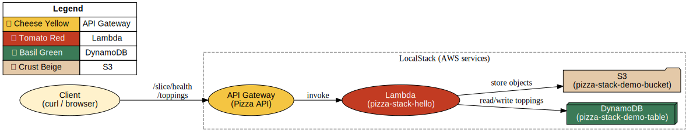

🍕 Pizza Stack — Serverless on LocalStack with Terraform

🚀 A locally emulated AWS serverless stack built with Terraform and LocalStack — demonstrating cloud IaC, API Gateway + Lambda integration, DynamoDB, and S3 — all wrapped in a fun pizza theme.

✨ Overview

This project provisions a serverless application entirely on LocalStack
 using Terraform.
It simulates common AWS services without incurring real cloud costs, making it perfect for demos, prototyping, and learning.

What it builds:

S3 bucket — iac-localstack-demo-bucket

DynamoDB table — iac-localstack-demo-table

Lambda function — iac-localstack-hello

API Gateway REST API — routes:

GET /slice/health (check stack health)

POST /toppings (increment pizza toppings counter)

A Python smoke test validates the stack with clear ✅/❌ output.

🛠️ Tech Stack

Infrastructure as Code: Terraform

Cloud Emulation: LocalStack

Compute: AWS Lambda (Python)

Storage: S3, DynamoDB

API Gateway: REST endpoints

Automation: Makefile for repeatable workflows

Validation: Python (boto3, requests) smoke checker

CI/CD Ready: Local GitHub Actions workflow (make ci-local simulates full pipeline)

📂 Project Structure
iac-localstack/
├── terraform/              # Terraform IaC for S3, DynamoDB, Lambda, API Gateway
│   ├── main.tf
│   ├── provider.tf
│   ├── variables.tf
│   └── outputs.tf
├── terraform/lambda/       # Lambda function & build script
│   ├── hello.py
│   └── build.sh
├── scripts/
│   ├── pizza_stack_check.py # Python smoke test (✅/❌)
│   └── requirements.txt
├── docs/
│   ├── architecture.dot     # Graphviz diagram source
│   ├── architecture.svg     # Rendered system diagram
│   └── architecture.png
├── docker-compose.yml       # LocalStack container
├── Makefile                 # Automation (up, tf-apply, smoke, ci-local, etc.)
└── README.md

🚀 Usage
1. Start LocalStack
make up

2. Build the Lambda
make lambda-build

3. Provision the stack
make tf-init
make tf-apply

4. Run smoke tests
make smoke


✅ LocalStack edge reachable
✅ S3 bucket exists
✅ DynamoDB table exists
✅ API Gateway routes responding

5. Full local CI run
make ci-local


Runs the complete pipeline: start LocalStack → build Lambda → Terraform apply → smoke checks → destroy → shutdown.

## 🖼️ Architecture Diagram



<details>
<summary>Graphviz source (docs/architecture.dot)</summary>

```dot
digraph pizza_stack {
    rankdir=LR;
    node [shape=box, style=rounded, fontname="Helvetica"];

    subgraph cluster_localstack {
        label="LocalStack (AWS services)";
        style=dashed;
        color=gray;

        apigw   [label="API Gateway\n(Pizza API)", shape=ellipse, style=filled, fillcolor="#f4c542", fontcolor="black"];
        lambda  [label="Lambda\n(pizza-stack-hello)", shape=ellipse, style=filled, fillcolor="#c23b22", fontcolor="white"];
        ddb     [label="DynamoDB\n(pizza-stack-demo-table)", shape=box3d, style=filled, fillcolor="#3b7a57", fontcolor="white"];
        s3      [label="S3\n(pizza-stack-demo-bucket)", shape=folder, style=filled, fillcolor="#e4c9a8", fontcolor="black"];
    }

    user [label="Client\n(curl / browser)", shape=oval, style=filled, fillcolor="#fff2cc", fontcolor="black"];

    user -> apigw [label="/slice/health\n/toppings"];
    apigw -> lambda [label="invoke"];
    lambda -> ddb   [label="read/write toppings"];
    lambda -> s3    [label="store objects"];

    legend [shape=none, margin=0, label=<
        <TABLE BORDER="0" CELLBORDER="1" CELLSPACING="0" CELLPADDING="4">
            <TR><TD COLSPAN="2"><B>Legend</B></TD></TR>
            <TR><TD BGCOLOR="#f4c542">🟡 Cheese Yellow</TD><TD>API Gateway</TD></TR>
            <TR><TD BGCOLOR="#c23b22"><FONT COLOR="white">🍅 Tomato Red</FONT></TD><TD>Lambda</TD></TR>
            <TR><TD BGCOLOR="#3b7a57"><FONT COLOR="white">🌿 Basil Green</FONT></TD><TD>DynamoDB</TD></TR>
            <TR><TD BGCOLOR="#e4c9a8">🍞 Crust Beige</TD><TD>S3</TD></TR>
        </TABLE>
    >];
}

</details>
🔑 Key Skills Demonstrated

Infrastructure as Code (Terraform)

AWS serverless design (Lambda, API Gateway, DynamoDB, S3)

Cloud emulation with LocalStack

Automated validation with Python (boto3, requests)

Build automation with Makefile

CI/CD workflow design

